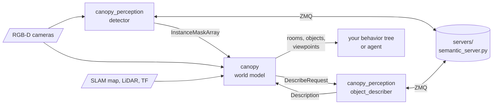
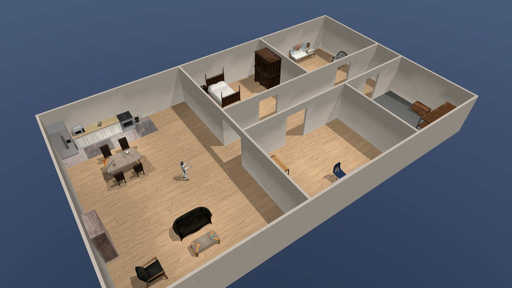
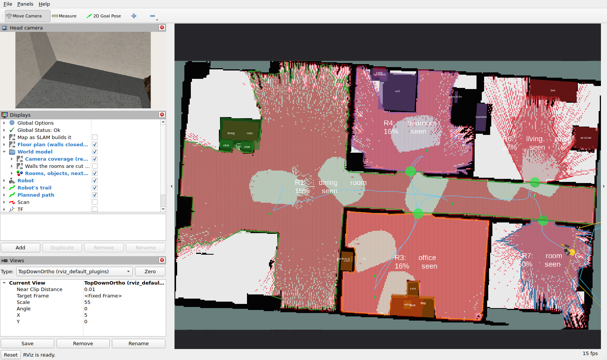
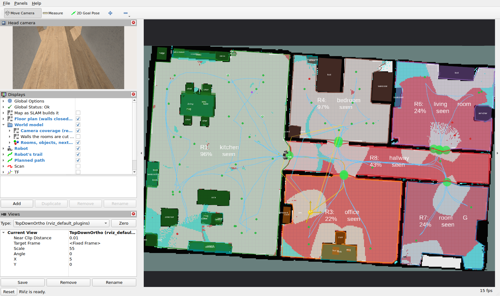
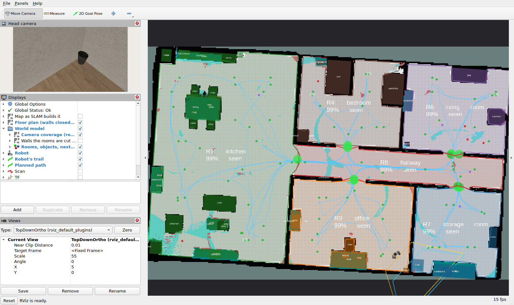
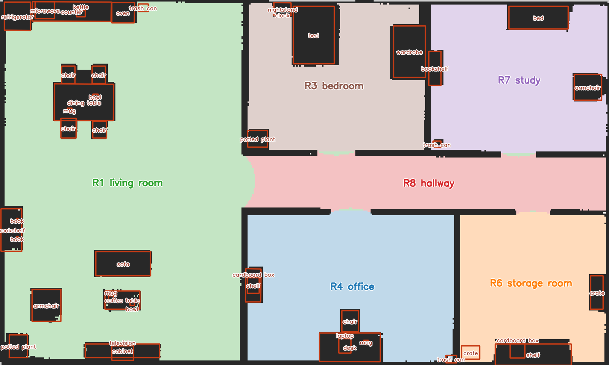
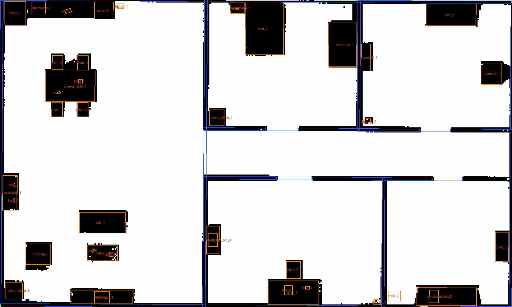
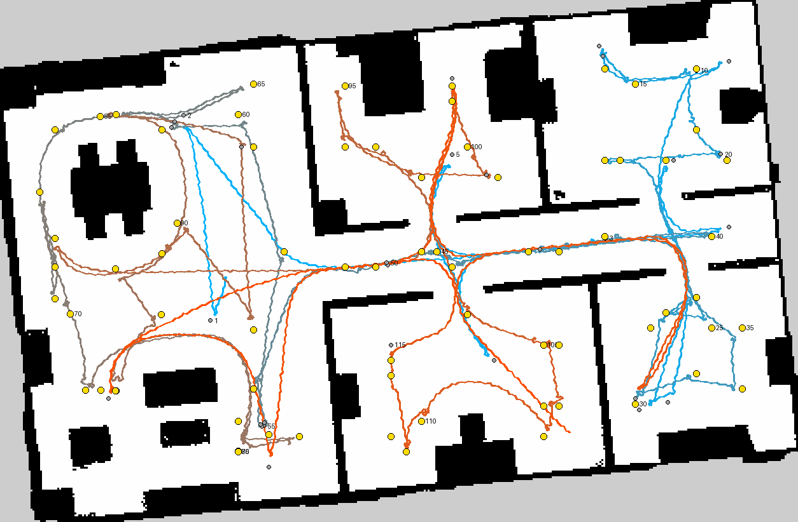
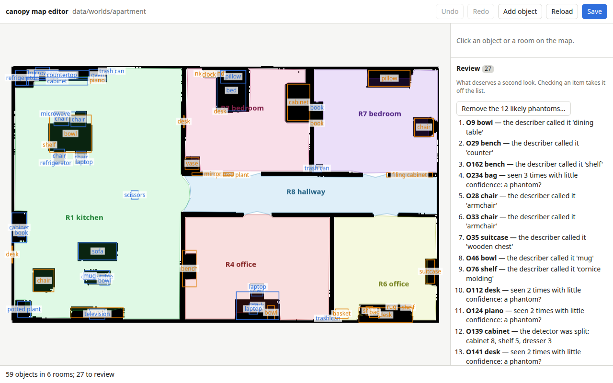
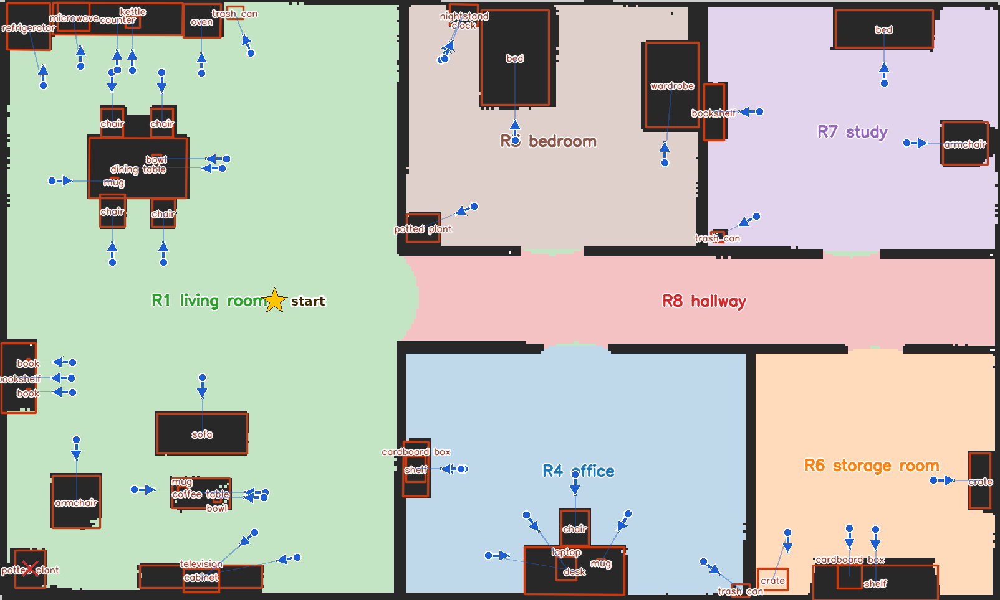

# canopy

A world model for ROS 2 robots that explore buildings. On top of the SLAM map it keeps:

- the **rooms** and the doorways between them,
- the **objects** in each room, found by an open-vocabulary detector,
- how much of every room the robot's **cameras** have actually seen.

It plans where to stand and look next, and answers "where is the dustbin" and "how do I get
there", so missions name targets instead of carrying coordinates. The models run on the host GPU,
and the ROS messages never name one.



| Part | What it is |
|---|---|
| [`canopy`](canopy) | The world model: rooms, camera coverage, objects, the viewpoint planner, and the ROS node around them. |
| [`canopy_msgs`](canopy_msgs) | Its interfaces: instance masks, rooms, objects, describer requests, and the search and exploration services. |
| [`canopy_perception`](canopy_perception) | The front end: a detector and a describer that ask the model servers, and a mock detector for simulators. |
| [`servers`](servers) | The models, on the host GPU: SAM 3.1 or YOLOE-26 detection, SigLIP 2 embeddings, and Gemini or a local Qwen VLM for names and room types. Not a ROS package. |
| [`editor`](editor) | A web page for checking a saved world by hand after a run: relabel, rename, delete, merge, split, move or add objects, and retype rooms. Not a ROS package. How to use it: [editor/doc/guide.md](editor/doc/guide.md). |

Built for ROS 2 Jazzy (Ubuntu 24.04), C++20.

## In pictures

The flat the pictures come from, in MuJoCo: a living room with an open kitchen and dining table,
a bedroom, a study with a day bed, an office, a storage room and the hallway between them, with 44
props and the Unitree G1 where it starts:



The simulated G1 exploring it from no map, watched in RViz (`rviz:=true`):

- each room is tinted and labelled with how much of it the cameras have seen;
- **red** is still to see, **cyan** what no standing spot can see;
- big green discs are doorways, small dots the viewpoints, the blue line the robot's trail;
- objects are boxed in their room's colour, and the head camera's picture sits top left.

| Frontier pass, 4 min | Camera pass, 21 min | Done, 35 min |
|---|---|---|
|  |  |  |
| The LiDAR map is still growing; the robot walks to its edges. | The map is closed; the robot goes where the cameras have seen least. | Every room 99 % seen. Asked for "the dustbin in the office", the robot walked to it. |

What the run leaves in `world_dir`:

| Semantic map | Against ground truth | The walk |
|---|---|---|
|  |  |  |
| `semantic_map.png`: rooms named, objects boxed and labelled, after the clean-up and a check in the map editor. | The saved floor plan with the scene's real walls (blue) and furniture (orange) drawn over it. | The robot's path, blue early to red late, and each viewpoint. |

The [map editor](editor/doc/guide.md) is for checking that world by hand afterwards:



Asked to go to an object, canopy picks where the robot should stand, 0.72 m off for the G1. That
is square to one of the object's sides and near its middle where one is clear, and round a corner
where walls or furniture hem every side in. Each blue dot is such a pose for an object of that
world, with the robot starting at the star, and its arrow is the way the robot faces. The potted
plant in the living room's corner (red cross) has none: the walls and furniture round it leave no
spot with the G1's clearance.



## Building

In a colcon workspace:

```bash
cd ~/ws/src && git clone https://github.com/Adyansh04/canopy.git
cd ~/ws && rosdep install --from-paths src --ignore-src -y
pip install msgpack-numpy==0.4.8            # no rosdep key; the Python nodes need it
colcon build --symlink-install
```

The model servers run outside ROS, on the host's GPU:

```bash
cd ~/ws/src/canopy
./servers/setup.sh                            # a uv virtualenv under ~/.local/share/canopy
./servers/start-vlm.sh start                  # optional: the offline describer
~/.local/share/canopy/.venv/bin/python servers/semantic_server.py
```

## Running it on a robot

```bash
ros2 launch canopy world_model.launch.py world_dir:=/data/worlds/home rviz:=true \
  cameras:=head=/camera odom_topic:=/odom cloud_topic:=/lidar/points \
  detector:=true describe:=true params_file:=my_robot_canopy.yaml
```

The robot needs:

- a latched `/map` from SLAM or `map_server`, and TF from `map` to its base and each camera;
- RGB-D cameras that publish as a RealSense driver does, and a LiDAR point cloud;
- its own values in `params_file`: footprint radius, walking and turning speeds, how long to wait
  for the detector;
- something to walk it through the exploration loop that [`canopy`](canopy#the-exploration-loop)
  describes. Nav2's `NavigateToPose` and `Spin` are enough.

## How well it does

On the simulated G1 above, from no map, with a head and a chest camera
([grove-g1](https://github.com/Adyansh04/grove-g1), where canopy began). The flat has 46 objects a
standing robot can see.

| Detector | Rooms | Walls seen | Objects found | Boxes (median IoU) | Time |
|---|---|---|---|---|---|
| Ground-truth masks | 6 of 6 | 96-99 % | 100 % | 0.76-0.80 | 30-34 min |
| SAM 3.1 + SigLIP 2 + describer | 6 of 6 | 96-99 % | 87-93 % | 0.68-0.72 | 31-33 min |
| YOLOE-26 (`detector_yoloe.yaml`) + SigLIP 2 + describer | 6 of 6 | 95-99 % | 72-85 % | 0.67-0.83 | 34-42 min |

With a real detector:

- SAM 3.1 names only what is there: 3 to 5 objects that are not in the flat, against YOLOE's 22
  on the same day. Most of its misses are names: the wardrobe comes back as a cabinet and a crate
  as a cardboard box, and an object seen only once is dropped unconfirmed.
- YOLOE confuses furniture of one material on the simulator's renders (desk, cabinet, TV stand)
  and misses mugs and bowls on tables.
- The describer names most of them correctly.

## Credits

- The world model reimplements ideas from Hydra, ConceptGraphs, OVO, DynaMem, VLFM, FUEL, TARE and
  Bormann et al.; [`canopy`](canopy#credits) links each.
- The models the servers run are credited in [`servers`](servers#models-and-libraries).

BSD 3-Clause; see [LICENSE](LICENSE).
