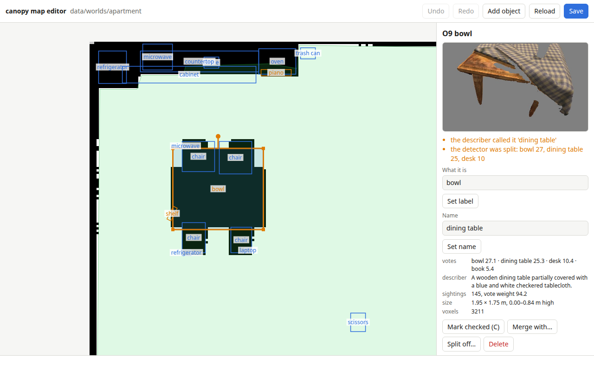
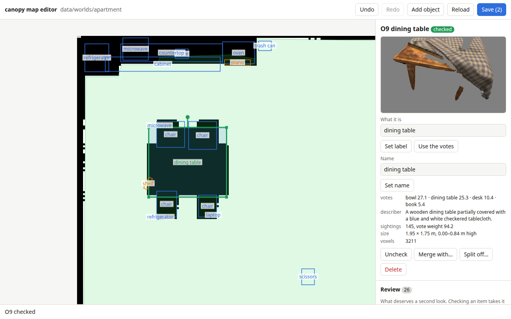
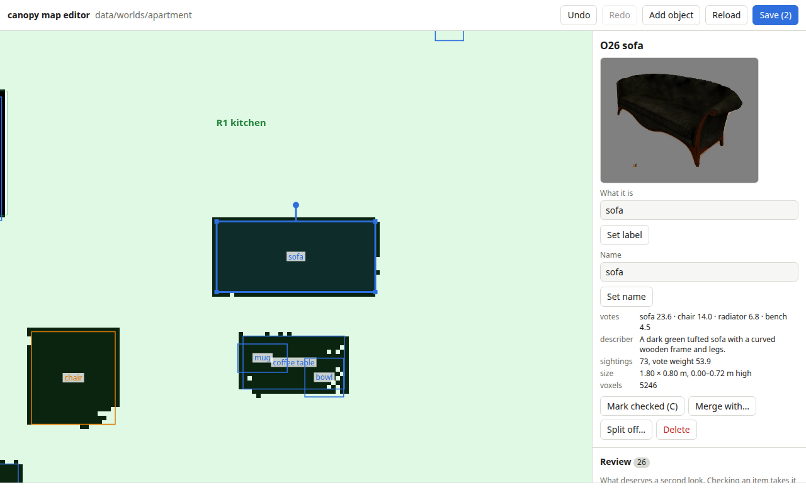
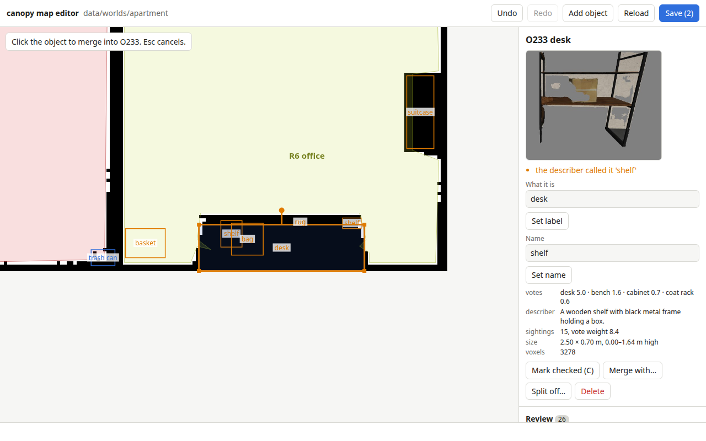
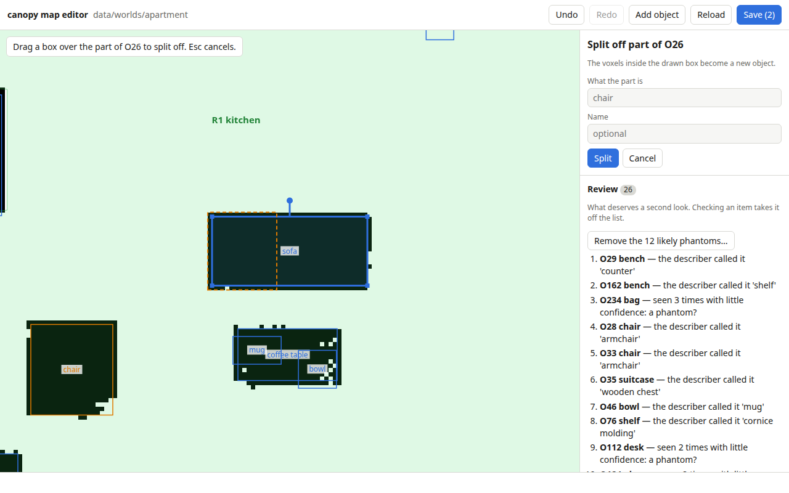
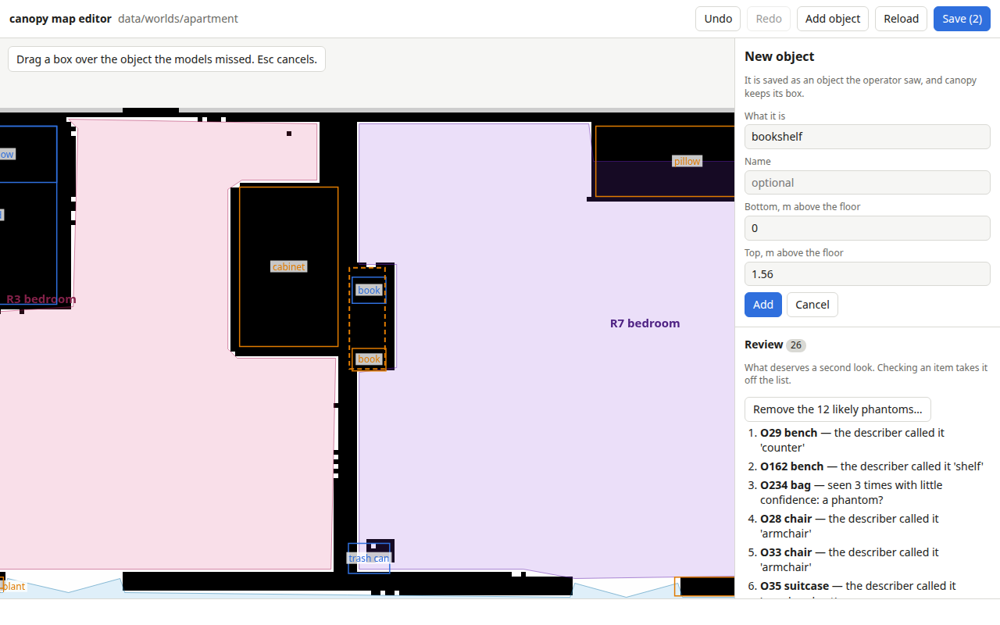
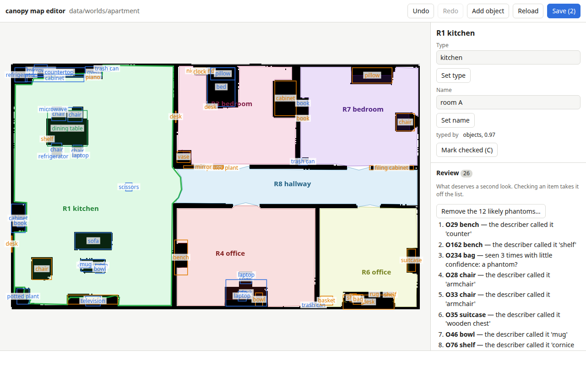
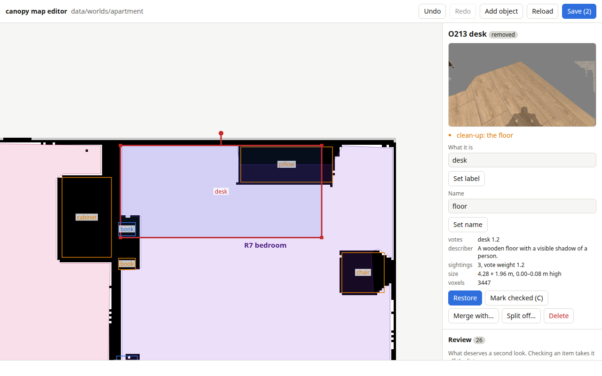
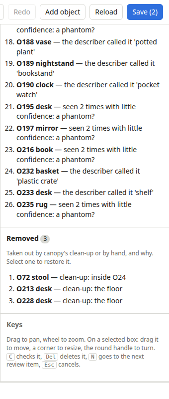
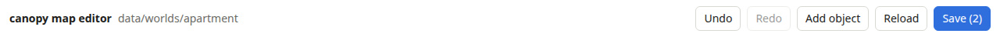

# Checking a map by hand

The world model gets some things wrong: a detector's word for an object, two objects that are one,
one it never saw. canopy's `~/clean_up`, called once exploring is over, takes out what is surely
no object: the floor mapped as a table, or a piece of a sofa seen as a chair. The editor is for the
rest. Nothing is written until you save, and every edit can be undone until then.

The screenshots are of a real run: the six-room test flat, explored by a simulated Unitree G1 with
the real models, then cleaned up.

## Opening a world

```bash
python3 editor/canopy_editor.py data/worlds/apartment    # then open http://127.0.0.1:8765/
```


- The map is the saved floor plan, each room tinted and named, with every object's box and label.
- A box is blue for an object, orange for one on the review list, green for one you checked, and red
  for a removed one you selected. A dashed box was placed by hand.
- The panel on the right shows what you selected, then the **Review** list, then **Removed**.
- The bottom line says what the last edit did. **Save** counts the edits not yet saved.

Drag to pan and use the wheel to zoom. Click a box to select it, or a room's floor to select the
room.

## Working through the review list

Click an item, or press <kbd>N</kbd> for the next one. The map centres on it and the panel shows
what the camera saw, why it is on the list, and what each model said.

| Before | After |
|---|---|
|  |  |
| The detector voted "bowl" for O9, just ahead of "dining table". The describer saw a dining table, and so does the picture. | Typed "dining table", **Set label**, then <kbd>C</kbd>: the box turns green and O9 leaves the list. |

What to check on each object:
- **The picture:** is it what the label says?
- **The describer's name and caption:** often the better word.
- **The votes:** a close second means the detector was unsure.
- **The box:** does it cover the object's footprint on the floor plan?

Your label wins from then on, while the votes go on counting underneath. **Use the votes** hands the
label back to the detector. A name you set is yours too: the describer leaves it alone. **Mark
checked** takes the object off the list without changing it.

## Fixing a box



Drag inside a selected box to move it, a corner to resize it, and the round handle to turn it. Check
it against the floor plan: the black cells under it are what the LiDAR saw of the object. A click
without a drag changes nothing. canopy keeps a box set by hand.

## Two objects that are one



The office shelf was mapped twice: as O233, which the detector called a desk (the describer saw "a
wooden shelf with black metal frame"), and as a small "shelf" at its end. Select the one to keep,
**Merge with…**, then click the other. Their votes, sightings and voxels add up. Then set the label.

## One object that is two



Select it, **Split off…**, and drag a box over the part. Say what the part is and **Split**. The
voxels inside the box become a new object, and both keep their labels, so canopy does not join them
again.

## An object the models missed



The detector found the two books in this bedroom but not the bookshelf they stand in. **Add
object**, drag its footprint on the map, then say what it is and how high it stands. It is saved as
an object an operator saw, and canopy keeps its box.

## Rooms



Click a room's floor. Check its type against what is in it: R1 was typed "kitchen" from its objects,
but it also holds a sofa, a television and a coffee table, so it is an open-plan living room and
kitchen. **Set type**, and the room typer and the describer leave it alone. Clearing the type hands
it back to them. The review list flags rooms typed with low confidence and rooms with no type yet.

## What was removed

| Removed object | The list |
|---|---|
|  |  |
| O213, removed by the clean-up as the floor. The picture is floorboards: leave it removed. | Everything taken out, and why. |

Removed objects stay in the file, off the map. Select one from the list to see it in red. If it is
real, **Restore** brings it back, checked, and the clean-up leaves it alone from then on.

**Remove the likely phantoms…**, above the review list, takes out every weakly seen, floor or piece
item at once, after listing them. The "weakly seen" rule also catches a real object now and then,
so read the list first. They go to Removed, where each can be restored.

## Saving



**Save** (<kbd>Ctrl</kbd>+<kbd>S</kbd>) writes `world.yaml` and `objects.bin`, and appends each edit
to `edits.log`. Undo reaches back to the last save.

If canopy is still running on the world, have it take the edits:

```bash
ros2 service call /canopy/reload std_srvs/srv/Trigger
```

If canopy saved while you were editing, **Save** refuses and offers to rebase: it reads canopy's
world and makes your edits again on it. Save again after that. `semantic_map.png` is canopy's
drawing, so it shows your edits after canopy's next save.

## Keys

| Key | Does |
|---|---|
| <kbd>N</kbd> | The next review item. |
| <kbd>C</kbd> | Checks or unchecks the selection. |
| <kbd>Del</kbd> | Deletes the selected object, after asking. |
| <kbd>Esc</kbd> | Leaves merge, split or add, or clears the selection. |
| <kbd>Ctrl</kbd>+<kbd>Z</kbd>, <kbd>Ctrl</kbd>+<kbd>Y</kbd> | Undo, redo. |
| <kbd>Ctrl</kbd>+<kbd>S</kbd> | Save. |
| <kbd>Enter</kbd> in a field | Its button. |
